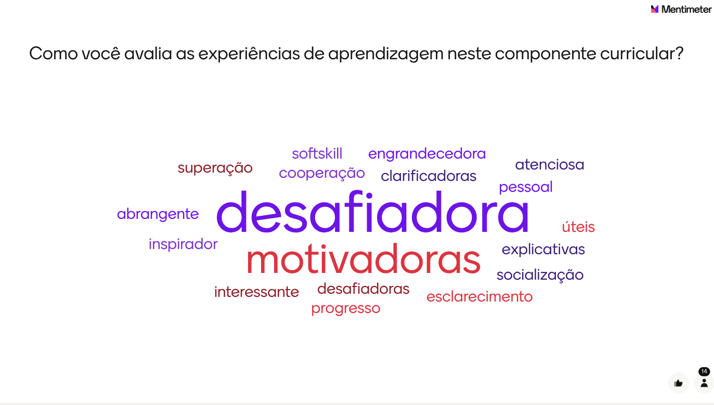
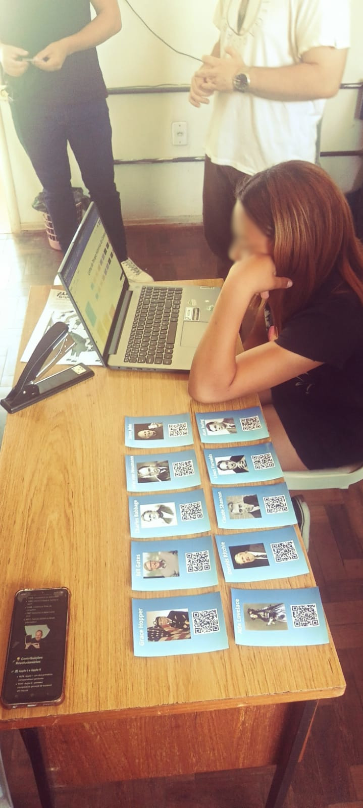
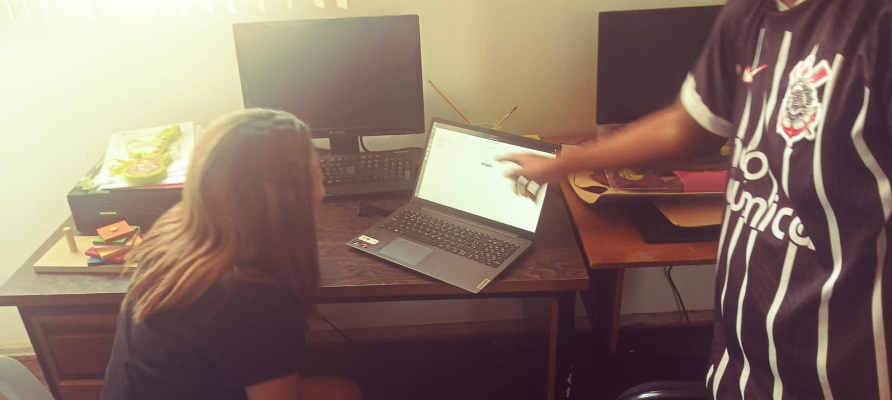
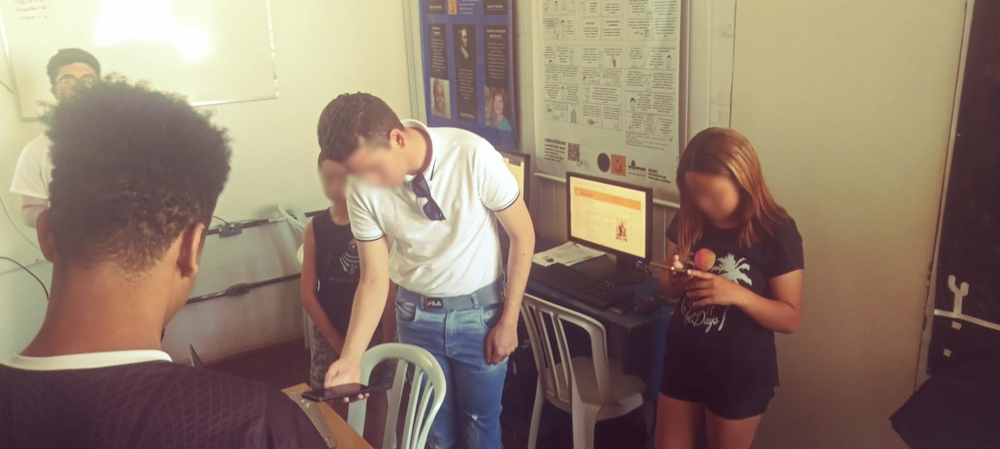

# Diario-de-campo

## Semana 03/12 a 09/12

### Em sala de aula

Nosso último encontro em sala de aula, ouvimos os últimos alunos que faltaram falar sobre a experiência deles na descilpina. Também discutimos mais sobre o plano de integralização das horas de extensão, e as professoras deixaram as suas impressões sobre a a experiencia na disciplina, Realizamos uma dinamica no site Mentimeter onde colocamos palaras qu representassem a nossa experiencia na disciplina, o quadro ficou assim:

### Fora de sala de aula

Realizei a entrega individual o plano de integralização das horas de extensão. Tenho planejado o cumprimento das minhas horas de extensão no Pretendo ccompletar minhas horas de unipampa cidadã aplicando ações extensionistas em 2026/1 no município de Uruguaiana. Meu planejamento é aplicar projetos em escolas da rede pública ou instituto federal (público alvo: alunos), trabalhando com monitoria para os alunos da sala de recursos do instituto federal ou oficinas voltadas para área da tecnologia (oficina de programação) se for em escolas estaduais/municipais. Essas atividades estão abertas a modificações caso outra demanda seja mais apropriada na escola que irei trabalhar.

Também realizei o formulário de avaliaçõa da disciplina no Moodle, considero que as principais contribuições da disciplina para mim foi a capacidade de ĺanejar ima ação extensionista de forma estruturadad e, cpm os intrumentos e  métodos certos

## Semana 26/11 a 02/12

### Em sala de aula

Fizemos uma roda de conversa para compartilhar nossas experiencias na disciplina, foi muitas experiencias que oponiões para ajudar a melhorar a disciplina no futuro, é muito importante a opinião dos colegas para esse fim. Também falei sobre a minha opinião de que achei interessante o método de ciclo de ação extensionista, foi o prinicpal elemento que coloquei no meu texto de resumo do SIEPE, também dei a sujestão de as professoras darem maior foco para ajudar os alunos a se organizarem nas primeiras semanas na disciplina, pois ela exige uma forma de organização completamente diferente das demais

### Fora de sala de aula

## Semana 19/11 a 25/11

### Em sala de aula

Professora explicou o próximo trabalho que é no modelo de resumo do SIEPE. Explicou toda a estrutura

### Fora de sala de aula

Realização do trabalho proposto
[escrever mais sobre a realização do trabalho]

## Semana 12/11 a 18/11

### Em sala de auala

Turma apresentou o quadro de avaliação. Ficou evidente que a maioria dos grupos realizou o trabalho de forma errada (incluindo o nosso), pois realizamos a atividade como se fosse uma avaliação posterior das ações de extensão realizadas, tanto planejamento e execução (na feira do livro e no CCFV no caso do TRAMAS). Porém o objetivo real do trabalho era levantar as demandas das instituições que recebemos na semana 22/ a 28 

## Semana 05/11 a 11/11

### Em sala de auala

Nesta semana não houve encontro em sala de aula

### Fora de sala de aula

Para cada camada de partes interessadas, foram identificados desafios específicos e formuladas propostas de intervenção:

- Camada Técnica: O principal problema identificado foi a dependência excessiva de tecnologia, que pode limitar o acesso ao material. Como solução, propõe-se o desenvolvimento de biografias impressas como alternativa complementar.

- Camada Formal: Constatou-se que o material pode não estabelecer conexão adequada com os interesses de todos os jovens. Para enfrentar esta questão, sugere-se a implementação de formulários simples de feedback junto aos alunos.

- Camada Informal: Identificou-se que as famílias frequentemente não compreendem o valor pedagógico das atividades. Como estratégia de superação, recomenda-se a criação de um canal no WhatsApp para compartilhar as atividades desenvolvidas e seus objetivos educacionais com as famílias.

## Semana 29/10 a 04/11

### Fora de sala de aula

Realizamos o mapeamento completo das partes interessadas envolvidas no projeto:

- Camada Técnica: Inclui a Equipe de Desenvolvimento do REA (Recurso Educacional Aberto), a Coordenação do Projeto de Extensão e o CCFV, que fornece o espaço físico e acesso aos usuários finais.

- Camada Formal: Engloba os alunos do 6º ano ao Ensino Médio do CCFV, educadores e mediadores (estagiários e coordenadora), bolsistas e extensionistas que aplicam o REA, escolas parceiras (Gaspar Martins e Lauro Dornelles) e professores universitários orientadores.

- Camada Informal: Compreende as famílias dos jovens atendidos e a comunidade escolar local, atores que sofrem impacto indireto mas significativo do projeto.

## Semana 22/10 a 28/10

### Em sala de auala

Na última semana, foi realizada uma sessão de diálogo com representantes de cinco entidades de relevância sociocultural e ambiental na região: a APAE, o Centro Cultural e Biblioteca Mário Quintana, a ONG Amoras e a Secretaria Municipal do Meio Ambiente.

O encontro, inserido no âmbito do projeto de extensão "Unipampa Cidadã", proporcionou a exposição detalhada das atividades, missões institucionais e demandas específicas de cada organização.

O projeto Unipampa Cidadã conecta a universidade com a comunidade. Por meio dele, a universidade leva conhecimento e apoio às instituições locais que precisam de ajuda, enquanto os alunos ganham experiência prática e aprendem sobre problemas reais. Essa troca beneficia todos: a comunidade recebe suporte qualificado e a universidade forma profissionais mais preparados e conscientes do seu papel na sociedade.

### Fora de sala de aula

Aplicamos o nosso Recurso Educacional Aberto (REA) no CCFV. A ação foi muito mais eficiente do que na Feira do Livro, pois no CCFV tivemos condições ideais: recebemos a atenção completa dos alunos e um horário reservado especialmente para nossa atividade. Essa organização permitiu que seguíssemos todo o planejamento original, possibilitando que os participantes realizassem cada etapa proposta do REA na ordem correta e sem interrupções. Como resultado, o aproveitamento do material foi muito maior, e o interesse dos alunos pelo conteúdo sobre história da computação foi significativamente melhor. Esta experiência comprovou como um ambiente organizado e dedicado contribui diretamente para o sucesso de ações de extensão universitária.

## Semana 15/10 a 21/10

### Em sala de aula

Na aula dessa semana nos foi apresentado conteúdos novos como: análise de domínio, diagnóstico semiótico e quadro de avaliação.

Esse conteúdo se baseia em cinco artefatos principais, que guiam a compreensão do problema e a proposição de soluções:

- Contextualização: Definição do escopo e dos limites do domínio a ser investigado.
- Artefatos: Identificação dos elementos tangíveis e intangíveis que compõem o domínio.
- Diagrama de Partes Interessadas: Mapeamento de todos os atores envolvidos.
- Quadro de Avaliação: Ferramenta para registrar problemas e soluções.
- Escada Semiótica: Estrutura teórica para analisar diferentes níveis de significado.

## Semana 08/10 a 14/10

### Em sala de aula

A turma passou por uma avaliação referente à construção dos Recursos Educacionais Abertos (REAs).

Foi interessante conhecer os REA desenvolvidos pelos outros grupos. A troca de ideias e experiências foi produtiva, com colegas compartilhando boas sugestões e relatos sobre a aplicação dos recursos com seus alunos. Esse momento de compartilhamento se mostrou um ponto positivo da atividade.

Durante a avaliação da nossa atividade as professoras alertaram para garantir o caráter verdadeiramente aberto do nosso recurso. Elas recomendaram que revisássemos as imagens e as referências textuais utilizadas, para confirmar se estão em domínio público ou sob licença de uso adequada. Todos esses aspectos foram devidamente ajustados após o feedback recebido.

### Fora de sala de aula

Como tarefa da semana, foi realizada a avaliação de impacto do nosso Recurso Educacional Aberto (REA), apresentado durante a Feira do Livro.

A atividade foi bem recebida pelos visitantes que passaram pela nossa exposição. A maioria demonstrou interesse nas cartas, o que criou a oportunidade para explicarmos o projeto e convidar os participantes a escanear os QR Codes.

Caso houvesse interesse, o participante poderia então completar a dinâmica do REA, explorando o material com mais calma e realizando os quizzes. Dessa forma, conseguimos envolver um número razoável de pessoas que concluíram todo o ciclo proposto pela atividade.

Enfrentamos um problema técnico: muitos dos participantes, especialmente alunos em visita escolar, não possuíam celular para escanear os códigos. Para resolver essa situação, disponibilizamos um aparelho do nosso grupo para que pudessem acessar o material.

## Semana 01/10 a 07/10

### Fora de sala de aula

Participamos da feira do livro onde apresentamos os nosso REA para a comunidade.

## Semana 24/09 a 30/09

### Em sala de aula

Nos reunimos para discutir o andamento do REA do nosso grupo. A professora passou orientações e sugestões para desenvolvermos o nosso REA para apresentar futuramente na feira do livro e depois no Centro de Convivência e Fortalecimento de Vínculos.

### Fora de sala de aula

Concluímos o desenvolvimento do nosso REA para apresentação na feira do livro de Alegrete.

O nosso REA possui os seguintes materiais:
- Cartas com personagens históricos da computação e um QR-code para cada um.
- Páginas no github abertas para o público para cada personagem histórico (contando a história de cada personagem).
- Linha do tempo histórica da computação relacionada com cada personagem histórico.
- Quiz de perguntas sobre cada personagem histórico.

Além disso, o REA conta com uma dinâmica que conecta cada um dos materiais.
Na dinâmica, a comunidade é convidada a escanear os QR-codes dos personagens para descobrir sobre a história de cada um. Em seguida, eles podem realizar os quizes de cada personagem. Para cada quiz realizado, uma parte da linha do tempo histórica é desbloqueada. Assim o objetivo é que diferentes pessoas contribuam para completar a linha do tempo histórica realizando pelo menos o quiz de um personagem.

[Acesse a linha do tempo](https://miro.com/welcomeonboard/cEgzOUQxZDNvcmZPWTRBUnRBS0pJUFlzMytVODNJNlZyeThUaTdoaUZldERtK3BXbFM2UE5nc2NlNmk1cjkwU0thVGt5clUyaFZuYVpLeFh6Ny9Hc2xSZDJFd1QrNDNvWkZ4ZWgreXpXMzJhRG9pTW5YeUM2Y0NRWVhvdjdHTTJ0R2lncW1vRmFBVnlLcVJzTmdFdlNRPT0hdjE=?share_link_id=643703402887)

[Github dos personagens da computação](https://github.com/Y4ngfr/personalidades)

## Semana 17/09 a 23/09

### Em sala de aula

Participamos de uma aula sobre Recursos Educacionais Abertos e sua acessiblidade, ministrada pela professora Daniele Schmitz.

Os Recursos Educacionais Abertos (REA) são materiais de ensino, aprendizagem e pesquisa disponibilizados de forma livre e gratuita, permitindo seu uso, adaptação e redistribuição por qualquer pessoa. Eles incluem desde textos, vídeos e imagens até cursos completos e softwares educacionais, geralmente licenciados de modo aberto, como por meio das licenças Creative Commons. A principal importância dos REA está em democratizar o acesso ao conhecimento, promovendo a equidade educacional, o compartilhamento de saberes e a colaboração entre educadores e estudantes. Além disso, os REA fortalecem a inovação pedagógica, estimulando práticas de ensino mais participativas, atualizadas e contextualizadas às diferentes realidades culturais e regionais.

## Semana 10/09 a 16/09

### Em sala de aula

Apresentamos o material de divulgação de ação extensionista em computação. O nosso grupo (Yang, Wesley Nogueira e João Pedro) escolheu o programa jedi.

O programa de extensão JEDI propõe-se a resolver problemas locais com o apoio de tecnologias computacionais e o envolvimento da comunidade (acadêmica e externa) em parceria com empresas públicas ou privadas, bem como fomentar um ecossistema de capacitação e treinamento em Tecnologias de Informação (TI).

### Fora da sala de aula

Realizamos uma visita técnica em grupo (Yang e Renilson) no Centro de Convivência e Fortalecimento de Vínculos para conhecer o local, os projetos que são realizados e discutir novos projetos extensionistas para serem implementados lá.

## Semana 03/09 a 09/09

### Em sala de aula

Participamos de uma dinâmica em grupo, cujos integrantes foram designados pelas professoras. O exercício propunha o levantamento de ideias para atividades de extensão, exigindo, para cada proposta, a identificação e a justificativa de sua relação com uma das diretrizes estabelecidas para a extensão universitária.

As diretrizes da extensão universitária que fundamentaram a atividade são as seguintes:

- Interação dialógica: Estabelecimento de um diálogo entre a universidade e a sociedade, promovendo a troca de saberes e experiências

- Interdisciplinaridade e interprofissionalidade: Integração de diferentes áreas do conhecimento e a colaboração com profissionais de diversas áreas para abordar questões complexa

- Indissociabilidade entre ensino, pesquisa e extensão: Articulação dessas três atividades como um processo único e integrado na universidade, fortalecendo a formação. 

- Impacto na formação do estudante: Contribuição da extensão para o desenvolvimento integral do estudante, promovendo o aprendizado prático, a cidadania e a consciência social

- Impacto na transformação social: Fomento de ações que promovam o desenvolvimento local e regional, atendendo às necessidades da comunidade e contribuindo para a justiça social.

Para o exercício, o nosso grupo (Yang Rodrigues, Nicolas Feijo, Vinicius Silva e Maria Heduarda) elaborou uma proposta de projeto que teve como diretriz principal a Interação Dialógica. A iniciativa buscava promover a comunicação e colaboração com escolas, instituições e fundações comunitárias, visando identificar suas demandas e problemas específicos. O objetivo central é que o conhecimento acadêmico seja mobilizado em diálogo com os saberes locais para, em conjunto, elaborar e implementar soluções adequadas a esses contextos.

### Fora da sala de aula

Realizamos uma atividade em grupo onde elaboramos um material de divulgação de ação extensionista em computação para apresentar na aula do dia 10/09.
