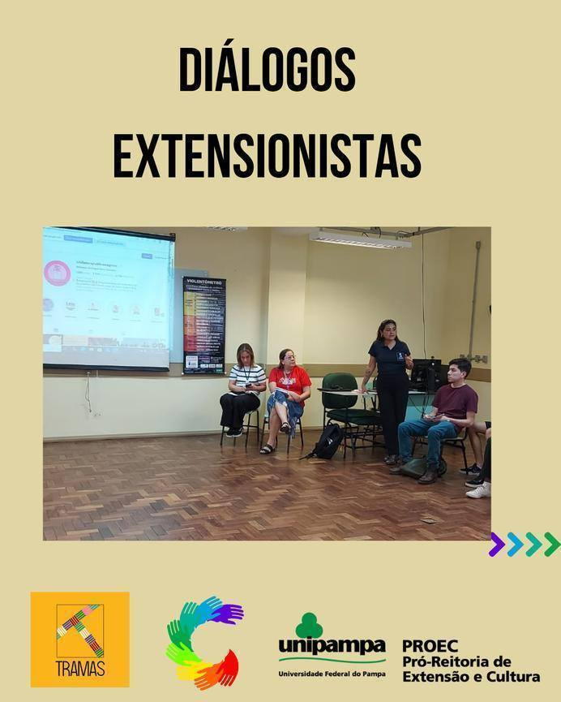
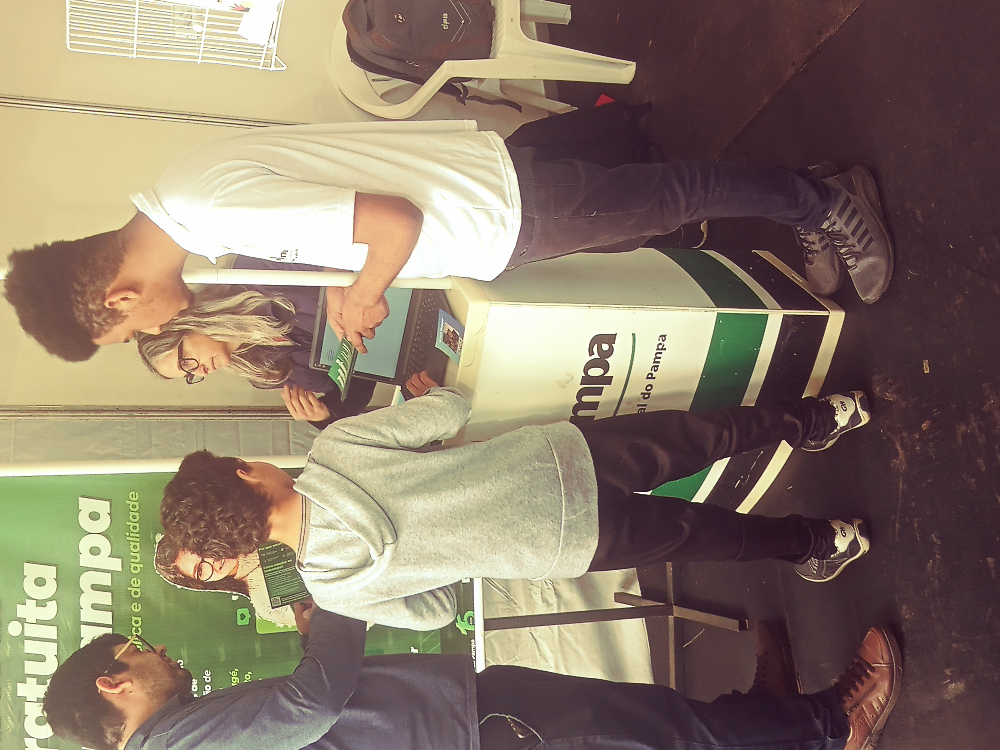
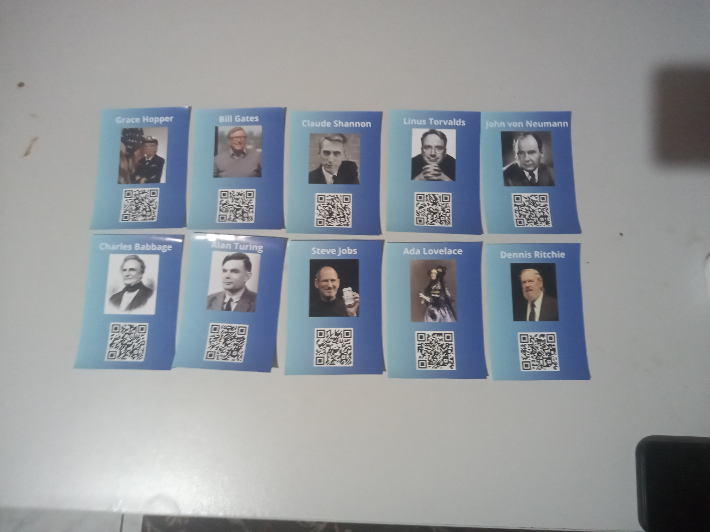
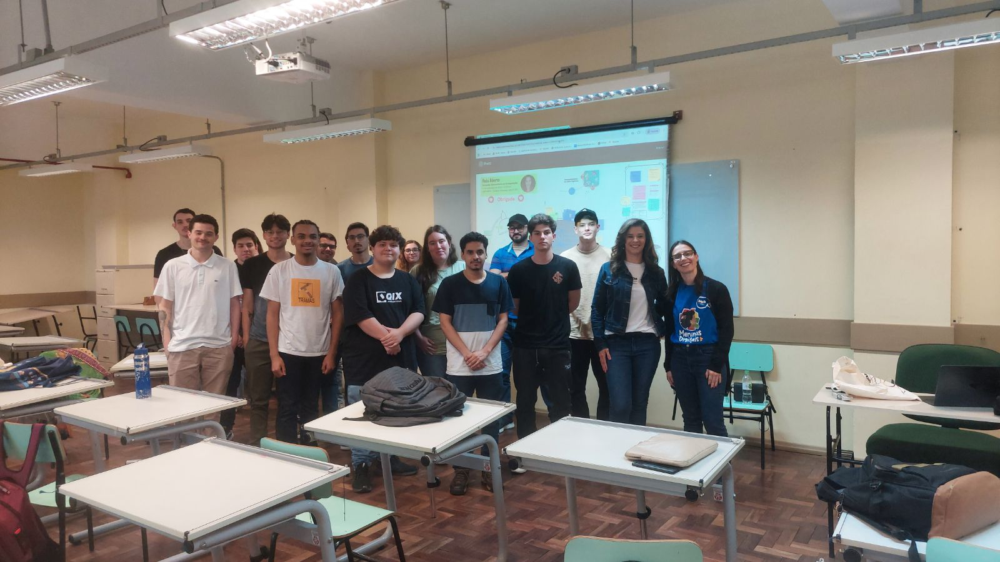
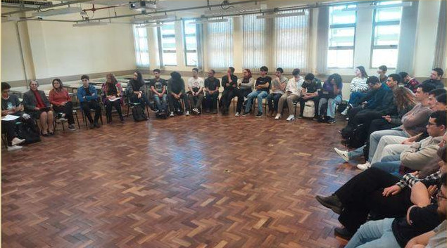
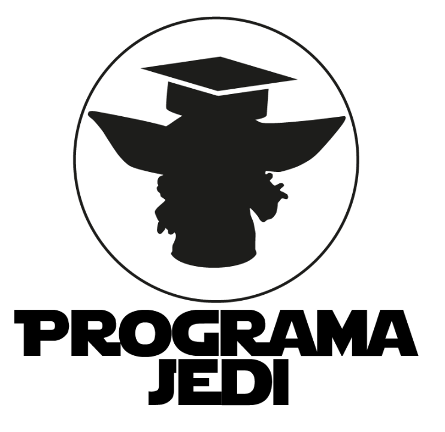
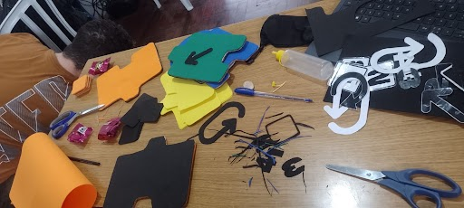

# Diario-de-campo

## Semana 19/11 a 25/11

### Em sala de aula

Professora explicou o próximo trabalho que é no modelo de resumo do SIEPE. Explicou toda a estrutura

### Fora de sala de aula

Realização do trabalho proposto

## Semana 12/11 a 18/11

### Em sala de auala

Turma apresentou o quadro de avaliação

## Semana 05/11 a 11/11

### Em sala de auala
### Fora de sala de aula

## Semana 29/10 a 04/11

### Fora de sala de aula

Realizamos a atividade do Quadro de Avaliação: Partes interessadas.
[descrever partes interessadas]

## Semana 22/10 a 28/10

### Em sala de auala

Participamos de uma conversa com APAE, Centro Cultural e Biblioteca Mário Quintana, ONG Amoras e Secretaria do Meio Ambiente. Eles falaram o que eles fazem qual é o papel deles e quais suas demandas. Essas Instituições são Unipampa Cidadã. 

## Semana 15/10 a 21/10

### Fora de sala de aula

(Participação no Centro de Convivencia e Fortalencimento de Vínculos)
Realizamos em grupo nossa ação extensionista de aplicação do REA. O REA foi muito melhor aplicado no CCFV do que na feira do livro. Pois no CCFV tivemos a total atenção dos alunos e um horário especial apenas para o nosso grupo executar a ação. Assim os alunos puderam passar por todas as etapas do REA corretamente, aproveitando muito mais os materiais didáticos do REA.

## Semana 08/10 a 14/10

### Em sala de aula

A turma foi avaliada quanto a construção dos REAs
(descrever mais)

### Fora de sala de aula

Como tarefa para essa semana ficamos encarregados de fazer a avaliação de impacto do nosso REA apresentado no feira do livro.
[descrever participação na feira do livro]

## Semana 01/10 a 07/10

### Fora de sala de aula

Participamos da feira do livro onde apresentamos os nosso REA para a comunidade.

## Semana 24/09 a 30/09

### Em sala de aula

Nos reunimos para discutir o andamento do REA do nosso grupo. A professora passou orientações e sugestões para desenvolvermos o nosso REA para apresentar futuramente na feira do livro e depois no Centro de Convivência e Fortalecimento de Vínculos.

### Fora de sala de aula

Concluímos o desenvolvimento do nosso REA para apresentação na feira do livro de Alegrete.

O nosso REA possui os seguintes materiais:
- Cartas com personagens históricos da computação e um QR-code para cada um.
- Páginas no github abertas para o público para cada personagem histórico (contando a história de cada personagem).
- Linha do tempo histórica da computação relacionada com cada personagem histórico.
- Quiz de perguntas sobre cada personagem histórico.

Além disso, o REA conta com uma dinâmica que conecta cada um dos materiais.
Na dinâmica, a comunidade é convidada a escanear os QR-codes dos personagens para descobrir sobre a história de cada um. Em seguida, eles podem realizar os quizes de cada personagem. Para cada quiz realizado, uma parte da linha do tempo histórica é desbloqueada. Assim o objetivo é que diferentes pessoas contribuam para completar a linha do tempo histórica realizando pelo menos o quiz de um personagem.

[Acesse a linha do tempo](https://miro.com/welcomeonboard/cEgzOUQxZDNvcmZPWTRBUnRBS0pJUFlzMytVODNJNlZyeThUaTdoaUZldERtK3BXbFM2UE5nc2NlNmk1cjkwU0thVGt5clUyaFZuYVpLeFh6Ny9Hc2xSZDJFd1QrNDNvWkZ4ZWgreXpXMzJhRG9pTW5YeUM2Y0NRWVhvdjdHTTJ0R2lncW1vRmFBVnlLcVJzTmdFdlNRPT0hdjE=?share_link_id=643703402887)

[Github dos personagens da computação](https://github.com/Y4ngfr/personalidades)

## Semana 17/09 a 23/09

### Em sala de aula

Participamos de uma aula sobre Recursos Educacionais Abertos e sua acessiblidade, ministrada pela professora Daniele Schmitz.

Os Recursos Educacionais Abertos (REA) são materiais de ensino, aprendizagem e pesquisa disponibilizados de forma livre e gratuita, permitindo seu uso, adaptação e redistribuição por qualquer pessoa. Eles incluem desde textos, vídeos e imagens até cursos completos e softwares educacionais, geralmente licenciados de modo aberto, como por meio das licenças Creative Commons. A principal importância dos REA está em democratizar o acesso ao conhecimento, promovendo a equidade educacional, o compartilhamento de saberes e a colaboração entre educadores e estudantes. Além disso, os REA fortalecem a inovação pedagógica, estimulando práticas de ensino mais participativas, atualizadas e contextualizadas às diferentes realidades culturais e regionais.

## Semana 10/09 a 16/09

### Em sala de aula

Apresentamos o material de divulgação de ação extensionista em computação. O nosso grupo (Yang, Wesley Nogueira e João Pedro) escolheu o programa jedi.

O programa de extensão JEDI propõe-se a resolver problemas locais com o apoio de tecnologias computacionais e o envolvimento da comunidade (acadêmica e externa) em parceria com empresas públicas ou privadas, bem como fomentar um ecossistema de capacitação e treinamento em Tecnologias de Informação (TI).

### Fora da sala de aula

Realizamos uma visita técnica em grupo (Yang e Renilson) no Centro de Convivência e Fortalecimento de Vínculos para conhecer o local, os projetos que são realizados e discutir novos projetos extensionistas para serem implementados lá.

## Semana 03/09 a 09/09

### Em sala de aula

Participamos de uma dinâmica em grupo, cujos integrantes foram designados pelas professoras. O exercício propunha o levantamento de ideias para atividades de extensão, exigindo, para cada proposta, a identificação e a justificativa de sua relação com uma das diretrizes estabelecidas para a extensão universitária.

As diretrizes da extensão universitária que fundamentaram a atividade são as seguintes:

- Interação dialógica: Estabelecimento de um diálogo entre a universidade e a sociedade, promovendo a troca de saberes e experiências

- Interdisciplinaridade e interprofissionalidade: Integração de diferentes áreas do conhecimento e a colaboração com profissionais de diversas áreas para abordar questões complexa

- Indissociabilidade entre ensino, pesquisa e extensão: Articulação dessas três atividades como um processo único e integrado na universidade, fortalecendo a formação. 

- Impacto na formação do estudante: Contribuição da extensão para o desenvolvimento integral do estudante, promovendo o aprendizado prático, a cidadania e a consciência social

- Impacto na transformação social: Fomento de ações que promovam o desenvolvimento local e regional, atendendo às necessidades da comunidade e contribuindo para a justiça social.

Para o exercício, o nosso grupo (Yang Rodrigues, Nicolas Feijo, Vinicius Silva e Maria Heduarda) elaborou uma proposta de projeto que teve como diretriz principal a Interação Dialógica. A iniciativa buscava promover a comunicação e colaboração com escolas, instituições e fundações comunitárias, visando identificar suas demandas e problemas específicos. O objetivo central é que o conhecimento acadêmico seja mobilizado em diálogo com os saberes locais para, em conjunto, elaborar e implementar soluções adequadas a esses contextos.

### Fora da sala de aula

Realizamos uma atividade em grupo onde elaboramos um material de divulgação de ação extensionista em computação para apresentar na aula do dia 10/09.
